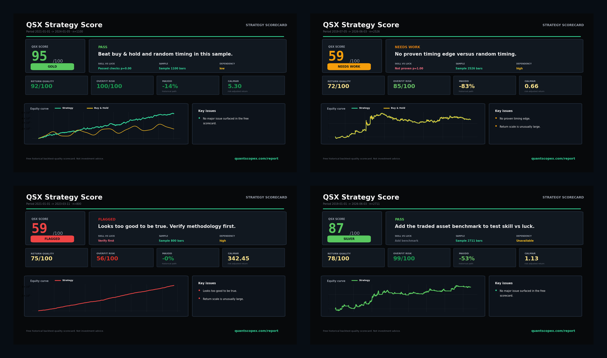

# QSX Strategy Score

[](https://github.com/jianweiweng05/qsx-strategy-score/actions/workflows/tests.yml)
[](LICENSE)
[](pyproject.toml)

Free open-source backtest screener for trading strategies.

Upload a return curve, equity curve, or trade log. In a few minutes, see whether the path looks more like alpha, market beta, luck, or a backtest that needs more evidence — without creating an account.

[**Try the free strategy scorecard**](https://www.quantscopex.com/tools?utm_source=github&utm_medium=readme&utm_campaign=qsx_strategy_score&utm_content=hero_scorecard)

Other ways to use it: [install the free Chrome extension](https://chromewebstore.google.com/detail/qsx-strategy-score/ledfoflekcjogmfnmomcnlkinfpblgck) · [run it locally](#install-and-run) · [free TradingView indicator](https://www.tradingview.com/script/nY7jGyZu/) · [Overlay Preview](https://www.quantscopex.com/tools?utm_source=github&utm_medium=readme&utm_campaign=qsx_strategy_score&utm_content=overlay) · [full audit report](https://www.quantscopex.com/report?utm_source=github&utm_medium=readme&utm_campaign=qsx_strategy_score&utm_content=audit_report) · [security](SECURITY.md)

Scoring thresholds and hosted components may still change before v1.0.

Upload a return curve, equity curve, or trade log. Get a fast **QSX Score** from 0 to 100, plus the checks that usually decide whether a backtest is worth more research.

- QSX Score and grade
- Overfit and too-good-to-be-true checks
- Buy-and-hold comparison
- Random timing test
- Monte Carlo stress test
- Shareable PNG scorecard
- Localized CLI, PNG scorecard, and web output (`en`, `zh`, `ja`, `ko`, `es`, `pt-BR`)
- Free Chrome extension
- Optional QSX Overlay Preview

Many strategies with a positive edge still fail because of poor risk sizing and exposure control. The optional Overlay Preview lets you test whether dynamic risk sizing may improve your own strategy.

## Free Chrome Extension

QSX Strategy Score is now available on the Chrome Web Store: [install the free Chrome extension](https://chromewebstore.google.com/detail/qsx-strategy-score/ledfoflekcjogmfnmomcnlkinfpblgck).

The extension is completely free. It lets you upload strategy exports, return curves, equity curves, or closed-trade logs directly from Chrome and get the same QSX screening score, diagnostics, and benchmark checks without setting up Python.

## Free TradingView Indicator

We also publish a free open-source TradingView script: [QSX Crypto Bottom & Top Risk Radar](https://www.tradingview.com/script/nY7jGyZu/).

It is a crypto market-context radar, not a trading bot or position-sizing engine. The script combines BTC perpetual long/short account ratio percentiles with trend, volatility, and trend-strength filters to mark sparse states such as `BOTTOM`, `CALM`, `TOP RISK`, and `HIGH RISK`.

If it helps your chart workflow, open it on TradingView, add it to a chart, and consider liking or favoriting it so more traders can find the free indicator.



## Positioning

QSX Strategy Score is not a replacement for QuantStats, pyfolio, or a full research notebook.

Use QuantStats when you want a detailed performance tear sheet. Use QSX Strategy Score when you want a fast screening answer:

```text
Is this backtest worth deeper due diligence, or does it look fragile, lucky, overfit, or mostly beta?
```

The output is intentionally compact: one path-quality score, evidence status, the main failure modes, a shareable scorecard, and an optional QSX Overlay Preview.

## How grades work

The 0-100 number describes the uploaded path. It does **not** prove real alpha or production readiness.

- `PROVISIONAL` means the path may look promising, but benchmark, random-control, sample, or track-record evidence is still incomplete.
- `GOLD`, `SILVER`, and `BRONZE` require comparable benchmark evidence and passed available free checks.
- `NEEDS WORK` and `FLAGGED` indicate a material weakness or a backtest that should be verified before trusting its score.

Read the [calibration policy](docs/calibration.md) and [release governance](docs/release-governance.md) for the exact boundaries and version policy.

Scorecards link to a full audit-report workflow at `quantscopex.com/report` for users who want deeper due diligence after screening.

## Overlay Preview

QSX Strategy Score can preview an external risk-sizing layer:

**QSX Crypto Universal Position Engine 1.0**

It is not an entry signal, exit signal, or coin selector. It is designed as an overlay that sits outside your original strategy:

```text
original strategy returns x QSX dynamic exposure = overlay-adjusted curve
```

Research audit example:


Your result may differ. The purpose is to test whether the overlay improves risk-adjusted performance on your own strategy.

Overlay Preview rejects trade logs with overlapping per-position trades. Upload an equity curve or daily return series so the preview uses the aggregate strategy path.

## Install and Run

From this repository:

```bash
git clone https://github.com/jianweiweng05/qsx-strategy-score.git
cd qsx-strategy-score
python -m pip install -e ".[app,excel]"
```

Score a strategy:

```bash
qsx-score examples/strategy_alpha.csv --asset BTC --lang en
```

Supported languages:

```bash
qsx-score examples/strategy_alpha.csv --lang zh
qsx-score examples/strategy_alpha.csv --lang ja
qsx-score examples/strategy_alpha.csv --lang ko
qsx-score examples/strategy_alpha.csv --lang es
qsx-score examples/strategy_alpha.csv --lang pt-BR
```

Export a shareable PNG, a three-page free diagnostic PDF, and JSON:

```bash
qsx-score examples/strategy_alpha.csv --asset BTC --out card.png --pdf diagnostic.pdf --json report.json
```

Run the web app:

```bash
streamlit run app/streamlit_app.py
```

## Example Result

```text
QSX Score: 59 / 100
Grade: NEEDS WORK

Headline:
Indistinguishable from random timing (p=0.32)
No proven timing edge.

Key problems:
- Max Drawdown: -83%
- Random timing test failed
- High dependency to buy-and-hold: corr +0.90, beta +0.82
```

This does not mean the strategy is useless. It means the uploaded return path looks more like asset beta plus risk exposure than proven timing edge.

## Input Formats

Returns:

```csv
date,return
2021-01-01,0.012
2021-01-02,-0.004
```

Equity curve:

```csv
date,equity
2021-01-01,10000
2021-01-02,10120
```

Trade log:

```csv
entry_time,exit_time,pnl_pct,side,symbol
2021-01-01,2021-02-01,3.2,LONG,DOGE
```

CSV, TSV, Excel, TradingView-style exports, return series, equity curves, and closed-trade logs are supported.

## Docs

- [Scoring model](docs/scoring.md)
- [Calibration policy](docs/calibration.md)
- [Release governance](docs/release-governance.md)
- [QSX Overlay Preview](docs/overlay.md)
- [Privacy boundary](docs/privacy.md)
- [Security policy](SECURITY.md)
- [Methodology notes](docs/methodology.md)

## Free vs Pro

| Layer | Free | QuantScopeX Pro |
| --- | --- | --- |
| Role | Screening | Due diligence |
| Main question | Is this worth investigating? | What does it depend on, when does it fail, and can it be production-ready? |
| Input | Returns, equity, trade log | Strategy file, asset context, cost/execution assumptions |
| Output | Text, JSON, PNG scorecard | Deeper strategy due-diligence report |

Free = screening. Pro = due diligence.

## Important Limitations

Free = screening, not proof. QSX Strategy Score is computed from the uploaded performance path; it does not inspect strategy code, raw market data, execution simulation, exchange fills, or the full parameter-search process.

It cannot prove the absence of code-level look-ahead, survivorship bias, unrealistic fills or slippage, hidden leverage, capacity constraints, manual selection, or train/validation contamination.

A high score is not investment advice. A flagged score does not prove a strategy is fake; it means the backtest method should be checked before trusting the result.

## License

MIT.
