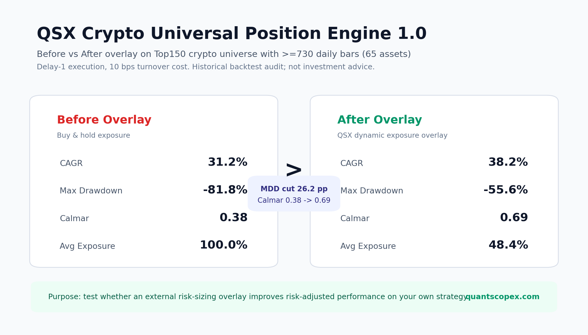

# QSX Strategy Score

免费开源的交易策略评分器。

上传一条策略收益曲线、净值曲线或交易日志，几秒内得到一个
**QSX Score**：0-100 分、策略结论、主要问题、过拟合风险、回撤风险、
买入持有对比、随机择时对比，以及可分享的 PNG 评分卡。

由 QuantScopeX 提供：

https://www.quantscopex.com/

> 目标很简单：让你先跑第一次测试，快速判断这个策略值不值得继续研究。



## What It Does

QSX Strategy Score 会从你上传的收益路径里回答几个最关键的问题：

- 这个策略是真有 edge，还是只是行情 beta？
- 它有没有跑赢买入持有？
- 它有没有跑赢随机择时？
- Sharpe / Calmar 是否高得不真实？
- 样本够不够，还是短期好运？
- 收益是不是集中在少数几笔交易或少数窗口？
- 最近表现是在稳定、变弱，还是衰减？
- 最大回撤和尾部风险是否被低估？

输出包括 QSX Score、策略等级、一句话结论、主要风险点、Monte Carlo 检查、
买入持有 / 随机择时对比、JSON 报告和可分享 PNG 评分卡。

## QSX Overlay Preview

Many strategies with a positive edge still fail because of poor risk sizing and exposure control.

QSX Strategy Score 内置一个可选入口：

**QSX Crypto Universal Position Engine 1.0**

中文名：

**QSX 虚拟币通用仓位控制器 1.0**

它不是新的买卖信号，也不是选币器。它更像一个可以叠加在你原策略外面的
**仓位风控插件**：

```text
原始策略收益 x QSX 动态仓位/风险系数 = 叠加后的风险控制曲线
```

它不改你的入场逻辑、不改你的出场逻辑、不重写你的策略；它只在策略外层根据
虚拟币市场状态动态调整风险暴露。

你可以把它理解为：

> 给任何虚拟币策略外面加一层通用风控 overlay。

### Audited Example

来自 `qsx-lab` 的通用虚拟币仓位控制器 1.0 审计样例：

```text
Universe: Top150 liquidity crypto, >=730 daily bars, 65 assets
Execution: delay-1, 10 bps turnover cost

Before Overlay
CAGR: 31.2%
Max Drawdown: -81.8%
Calmar: 0.38
Avg Exposure: 100.0%

After Overlay
CAGR: 38.2%
Max Drawdown: -55.6%
Calmar: 0.69
Avg Exposure: 48.4%
```

Your result may differ. The purpose is to test whether the overlay improves
risk-adjusted performance on your own strategy.

### What Was Tested

QSX 虚拟币通用仓位控制器 1.0 在 `qsx-lab` 中做过 Top150 流动性虚拟币扩展审计，
覆盖 Binance-style USDT 日线数据，包括：

- Top100 / Top150 流动性币种 universe
- 全量可用币种
- 365 天以上历史样本
- 730 天以上历史样本
- 与 buy-and-hold 对比
- 与简单 200D 均线风控对比
- 与波动率目标 overlay 对比
- train / holdout 口径
- 极端行情与主要回撤窗口检查

在验证过的中大型虚拟币 universe 中，它的目标不是预测每个币明天涨跌，而是改善策略或组合的风险调整后暴露：

- 高风险 / 高波动 / 下跌或震荡阶段降低风险
- 市场状态恢复后逐步回到正常暴露
- 尽量减少深度回撤对策略净值的破坏
- 让原策略保留自己的 alpha，同时外接一层统一风控

### How Preview Works

在 Streamlit 页面点击 Overlay Preview 后：

1. 本地把你的收益、净值或交易日志标准化成每日 `date,return`
2. 调用 QuantScopeX 托管预览 API
3. 返回原策略 vs QSX Overlay 后的对比结果
4. 对比 Max Drawdown、Calmar、Sharpe 等指标

隐私边界：

```text
Only normalized date-return series are transmitted.
Raw files, strategy code, trade logs and account information remain local.
```

开源仓库不包含生产级 controller 序列和私有引擎。Preview 的定位是：

> 先免费测试：你的策略外面加一层 QSX 通用虚拟币仓位控制器，风险收益结构会不会变好。

## Example Report

示例：`examples/strategy_beta.csv`

这个样例会被自动识别为 DOGE 相关策略。

```text
QSX Score: 59 / 100
Grade: NEEDS WORK

Headline:
Indistinguishable from random timing (p=0.32)
No proven timing edge.

Key problems:
- Max Drawdown: -83%
- Random timing test failed
- High dependency to buy-and-hold: corr +0.90, beta +0.82
- One month returned +264%, scalability needs verification

Pillars:
- Return quality: 72
- Overfit-risk detection: 85
- Drawdown control: 70
- Edge vs hold/random: 52
```

命令：

```bash
qsx-score examples/strategy_beta.csv --lang en --json report.json
```

这个结果的含义不是“策略一定没用”，而是：

> 这条收益路径看起来更像 DOGE 行情 beta + 风险暴露，而不是已经证明的择时 edge。

下一步可以做什么？

1. 简化策略规则，确认信号是否真的增加 alpha。
2. 补充更多样本外或实盘 forward 证据。
3. 测试外层风控 overlay，看看风险 sizing 是否能改善回撤结构。

## Install

开发模式安装：

```bash
pip install -e ".[card,excel]"
```

运行测试：

```bash
pip install -e ".[dev]"
pytest -q
```

未来发布后：

```bash
pipx install qsx-score-free
```

## CLI

基础评分：

```bash
qsx-score examples/strategy_alpha.csv --asset BTC --lang zh
```

输出 PNG 分享卡和 JSON 报告：

```bash
qsx-score examples/strategy_alpha.csv --asset BTC --lang zh --out card.png --json report.json
```

指定交易日志：

```bash
qsx-score /path/to/DOGE7H.csv --asset DOGE --input-type trade_log --lang zh
```

查看可用资产库：

```bash
qsx-score --list-assets
python -m qsx_strategy_score.assets --keys BTC ETH SOL DOGE SPY QQQ
```

支持语言：

```text
en, zh, ja, ko, es, pt-BR
```

## Streamlit App

```bash
pip install -e ".[app,excel]"
streamlit run app/streamlit_app.py
```

网页端可以直接上传策略文件，生成评分、图表、主要问题、Monte Carlo、
PNG 评分卡，并可选择运行 QSX Overlay Preview。

## Input Formats

收益率：

```csv
date,return
2021-01-01,0.012
2021-01-02,-0.004
```

净值曲线：

```csv
date,equity
2021-01-01,10000
2021-01-02,10120
```

交易日志：

```csv
entry_time,exit_time,pnl_pct,side,symbol
2021-01-01,2021-02-01,3.2,LONG,DOGE
```

交易日志里的 `pnl_pct` 会按百分比处理。注意：closed-trade drawdown 可能低估持仓过程中的真实浮亏，真实风险最好提供 bar-level MTM equity。

## Python API

```python
from qsx_strategy_score import load_returns, score_unified, build_triage_diagnostics

r, meta = load_returns("examples/strategy_alpha.csv")
report = score_unified(r, "crypto", meta=meta)
triage = build_triage_diagnostics(r, report, meta=meta).to_dict()

print(report.display, report.grade)
print(report.headline)
print(triage["edge_persistence"])
```

## Free vs Pro

| Layer | Free | QuantScopeX Pro |
| --- | --- | --- |
| Role | Screening | Due diligence |
| Question | Is this worth investigating? | What does it depend on, when does it fail, and can it be production-ready? |
| Input | returns, equity, trade log | strategy file, asset context, cost/execution assumptions |
| Output | text, JSON, PNG scorecard | deeper strategy due-diligence report |

Free 是筛查。Pro 是尽调。

## What It Cannot Prove

QSX Strategy Score 只根据你上传的收益路径计算。它不能证明：

- 没有未来函数
- 没有幸存者偏差
- 没有参数海选泄露
- 成交价格真实可得
- 滑点和手续费足够保守
- 杠杆和容量真实可复制
- 未来一定能赚钱

高分不代表投资建议，也不代表未来收益预测。  
FLAGGED 不代表策略一定是假的，只代表这条收益路径需要先核查回测方法。

## Development

```bash
pip install -e ".[dev]"
pytest -q
python examples/make_samples.py
```

## License

MIT.
