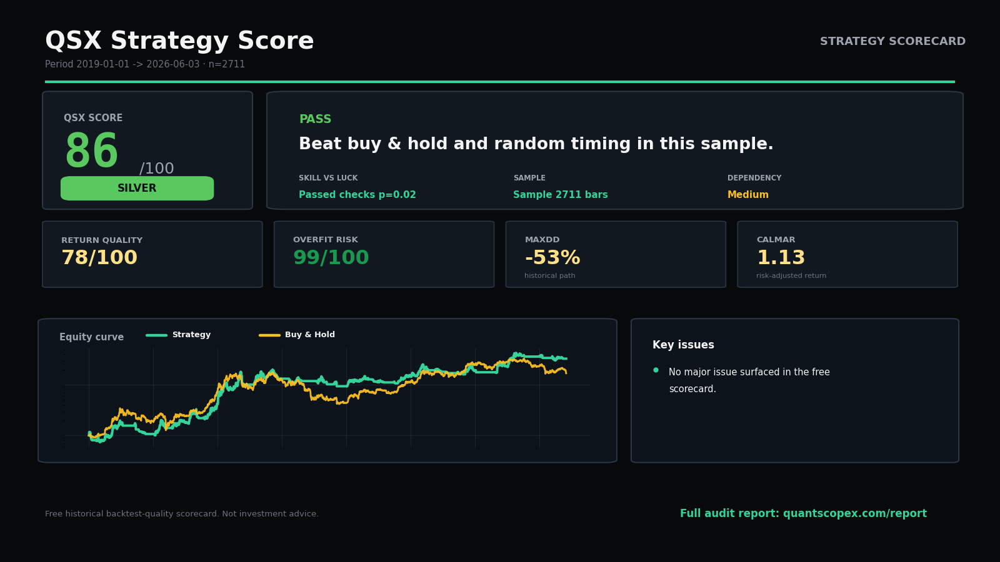
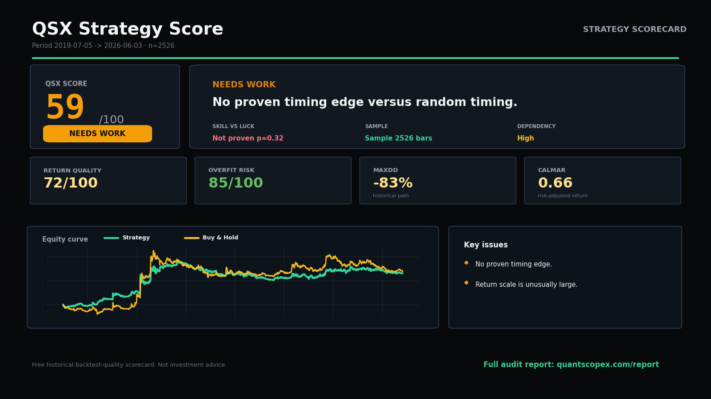
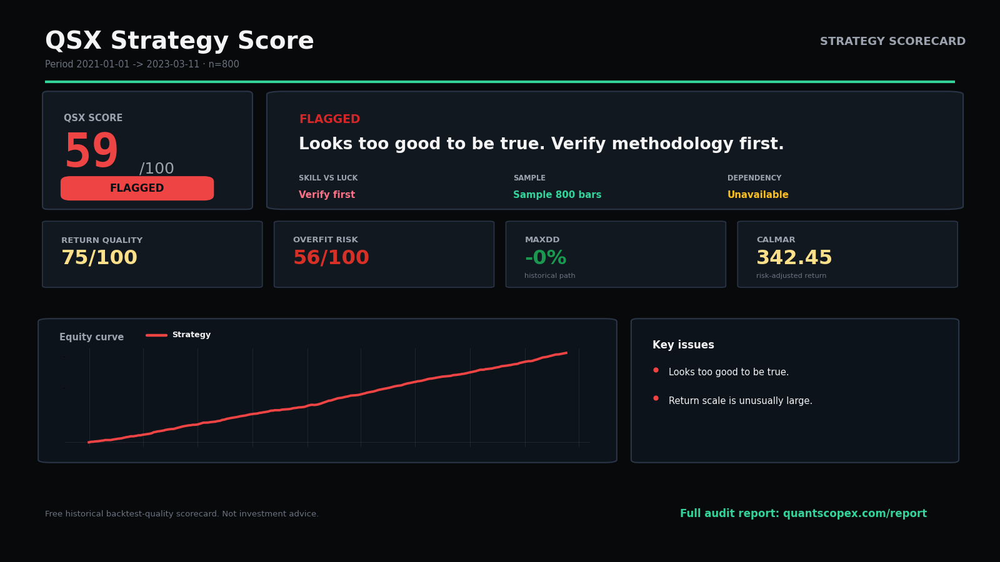

# Case Studies: Three Backtests, Three Verdicts

Every score below is reproducible from the bundled example files — no cherry-picking, no hand-tuned inputs. Clone the repo and run the commands yourself.

The point of these three is that they look *similar* on a naive metric (all three are net profitable, all three have a respectable-looking equity curve), but the QSX Score separates them into three very different verdicts once buy-and-hold, random timing, and data-integrity checks are applied.

| File | Command | Score | Grade | Verdict |
| --- | --- | --- | --- | --- |
| `strategy_alpha.csv` | `qsx-score examples/strategy_alpha.csv --asset BTC` | **86.3** | SILVER | Beat buy & hold AND random timing (p=0.02) |
| `strategy_beta.csv` | `qsx-score examples/strategy_beta.csv` | **59.0** | NEEDS WORK | Indistinguishable from random timing (p=0.32) |
| `sample_flagged.csv` | `qsx-score examples/sample_flagged.csv` | **59.0** | FLAGGED | Looks too good to be true |

---

## 1. Real edge candidate — SILVER (86.3)

```bash
qsx-score examples/strategy_alpha.csv --asset BTC
```



A 7.4-year track record at ~60% CAGR. What earns the SILVER grade is not the return — it's that the strategy clears both gates:

- **Beats buy & hold** on a risk-adjusted (Calmar) basis, so the return is not just BTC beta.
- **Beats random timing** (p=0.02): only 2% of random long/flat controls on the same asset did as well, so the timing is unlikely to be luck.

Pillars: Return quality 78, Credibility 99, Drawdown risk 78. No red flags. It is capped just below GOLD because a metal above SILVER is *earned* with more history — this is a "prove it over more years" verdict, not a defect.

## 2. The beta trap — NEEDS WORK (59.0)

```bash
qsx-score examples/strategy_beta.csv
```



This curve is profitable and, at a glance, looks fine. But it **cannot be distinguished from random timing** (p=0.32): roughly a third of random long/flat controls matched it. That means the uploaded path looks more like asset exposure plus luck than a proven timing edge, so the tier is withheld and the score is capped below passing.

This is the most common and most dangerous outcome — a strategy that looks like alpha but is really beta wearing a costume.

## 3. Too good to be true — FLAGGED (59.0)

```bash
qsx-score examples/sample_flagged.csv
```



A suspiciously smooth curve (the kind an interpolated or look-ahead-contaminated backtest produces). The data-integrity screen fires several flags at once:

- `STALE_OR_INTERPOLATED` — lag-1 return autocorrelation is too high; equity may be interpolated or stale-marked.
- `SHARPE_TOO_GOOD` — annualized Sharpe is implausibly high for the asset class.
- `NEAR_MONOTONIC` — too many positive periods with almost no drawdown.
- `BACKGROUND_CALMAR` — Calmar > 10; verify mark-to-market drawdowns, leverage, and fills.

Credibility collapses to the low 50s and the whole result is capped and marked FLAGGED. A flagged score doesn't *prove* the backtest is fake — it means the method should be verified (look-ahead / survivorship / unrealistic fills) before trusting any number.

---

## Reproduce all three

```bash
git clone https://github.com/jianweiweng05/qsx-strategy-score.git
cd qsx-strategy-score
python -m pip install -e ".[app,excel]"

qsx-score examples/strategy_alpha.csv --asset BTC
qsx-score examples/strategy_beta.csv
qsx-score examples/sample_flagged.csv
```

A high score is not investment advice, and a flagged score is not proof of fraud. The score answers one question: **is this backtest worth deeper due diligence, or does it look fragile, lucky, overfit, or mostly beta?**
