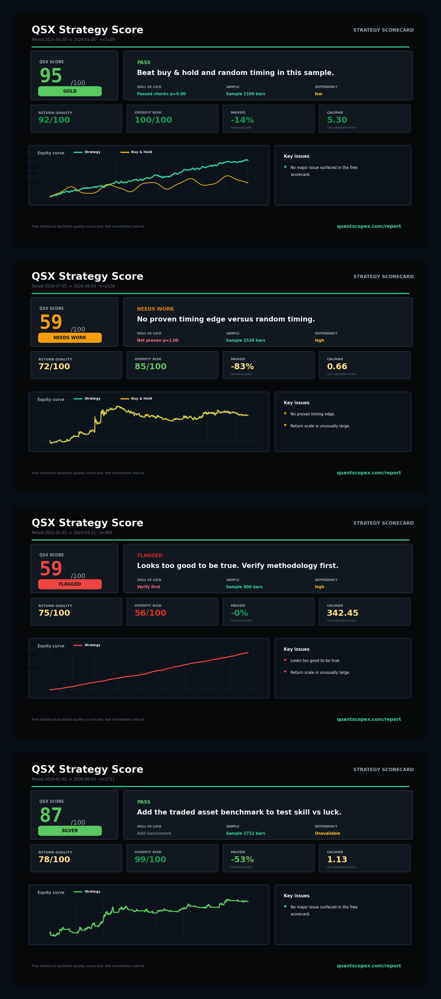

# Scoring Model

QSX Strategy Score is a fast screening layer for trading backtests. It reads a return curve, equity curve, or trade log and produces a 0-100 score with a plain-English verdict.

The free score is built around four questions:

1. Is the return path profitable and risk-adjusted enough to be worth investigating?
2. Does the curve look too clean, too concentrated, or too good to be true?
3. Is the drawdown profile acceptable for the reported return?
4. Does the strategy beat buy-and-hold and random timing when a benchmark is available?

The score is intentionally conservative. A backtest can have attractive returns and still be capped if it fails the random-timing test, depends heavily on buy-and-hold exposure, has too little sample, or looks implausibly smooth.

## Outputs

- QSX Score from 0 to 100
- Grade: GOLD, SILVER, BRONZE, NEEDS WORK, or FLAGGED
- Headline verdict
- Return quality score
- Overfit-risk detection
- Drawdown control score
- Edge vs buy-and-hold/random timing
- Sample sufficiency
- Edge persistence lite
- Dependency lite
- Monte Carlo stress summary
- JSON report
- Shareable PNG scorecard

## Sample Scorecards

The README shows the compact overview. The full sample wall below shows four common outcomes: real edge candidate, beta trap, too-clean-to-trust, and benchmark-needed.

## Common Outcomes

`PASS` means the uploaded curve passed the available free checks. It still needs live or out-of-sample evidence before production use.

`NEEDS WORK` means the curve has a material weakness such as deep drawdown, weak timing evidence, high benchmark dependency, thin sample, or unstable return concentration.

`FLAGGED` means the curve looks suspicious enough that the backtest method should be checked before trusting any score.
